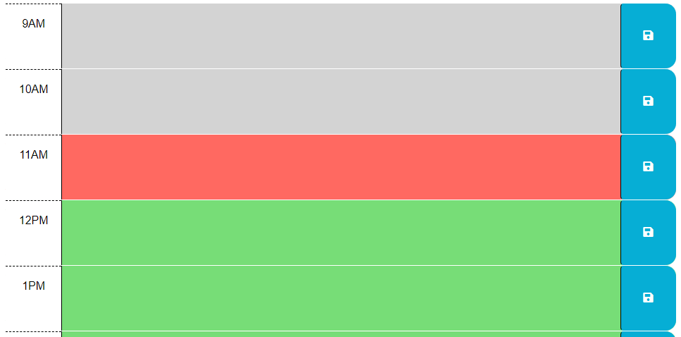
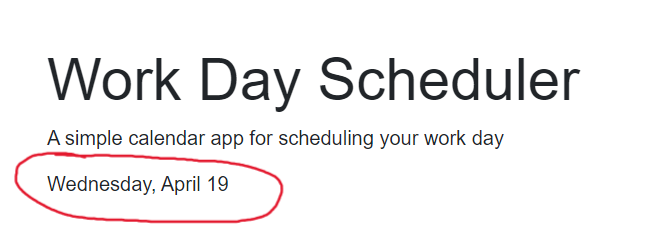
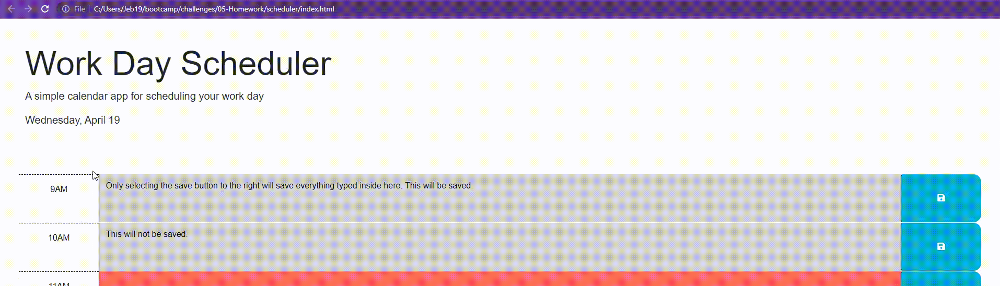
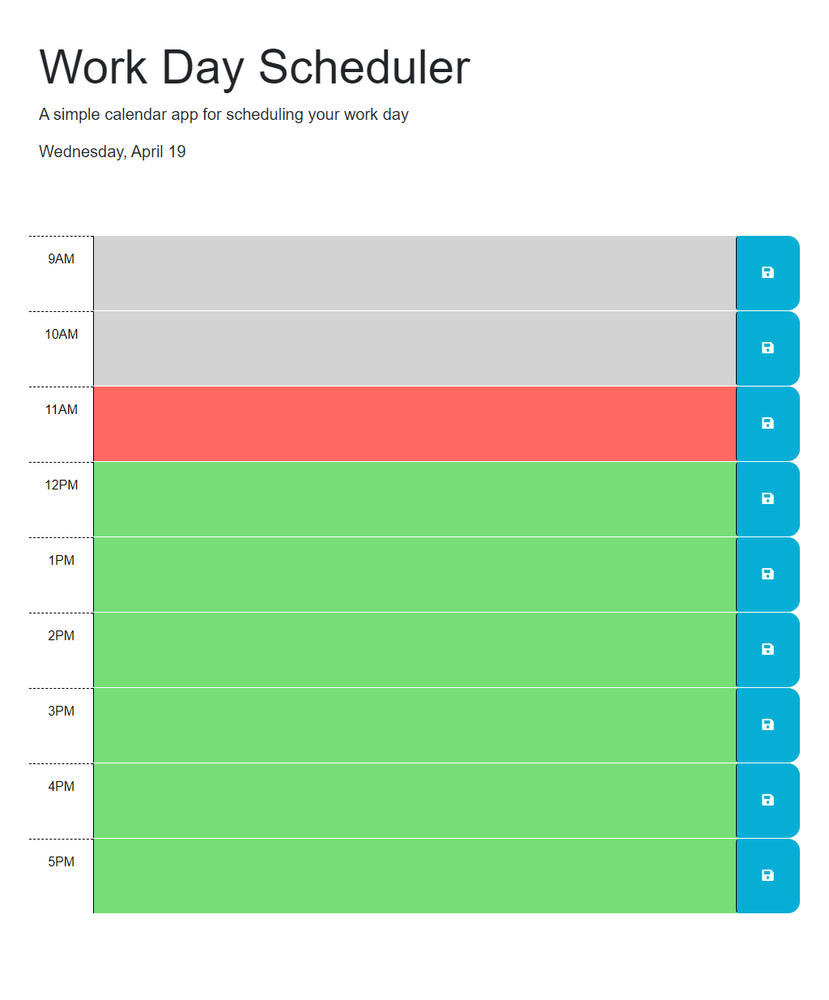

# Work Day Scheduler

## About
As a student with a busy schedule, it is crucial that I find ways to effectively manage my time. This application will help me do just that. It serves as a day planner, where I can schedule out activities and tasks that need to be completed. Each time slot has a save button, where the tasks can be saved into the browser's local storage. Upon reloading the page, any previously saved tasks will be generated onto the page into their according time blocks. The application can be used to plan out the day, and it can be closed out and reopened at any point for reference. This project was also my first one working with JQuery, so I now have more understanding of how it is written and used within an applicaiton.
## Table of Contents
- [Installation](#installation)
- [Usage](#usage)
- [Features](#features)
- [Deployed-Application](#deployed-application)

## Installation
All that is required is a device with access to an internet browser.
## Usage
The application can be used to plan out your day. The time blocks run from 9-5, a typical day for most full-time jobs. Type in your task at the time you want to be working on it and click the save button to the right if you want it to persist.

After planning out your day, you can close the application, if you want, and reopen it for reference whenever you need.

At any point, you can change whichever task to a different one and save to reflect that change.

## Features
The time blocks will be color coded based on past, present, and future tense. The applicaiton checks the current time and color codes the blocks based on that current time. 

Grey colored time blocks are in the past, red is in the present, and any green time blocks are yet to come in the future.

For example, the time was 11AM when this image was taken: 
### 

Upon loading the page, the current date will be displayed at the top of the page:
### 

The save buttons are specific to their adjacent time blocks, so the save button for the 9AM time block will only save what is typed inside that time block.

Example here:
### 

## Deployed Application
**Live URL Here:** [_https://jebulger.github.io/work-day-scheduler/_](https://jebulger.github.io/work-day-scheduler/)

### 
